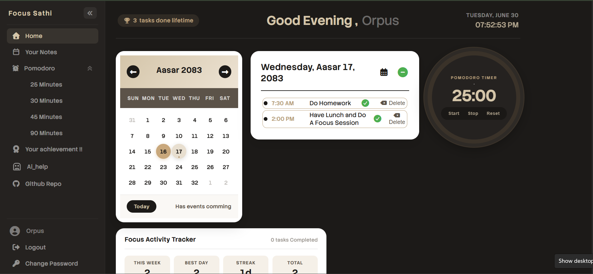
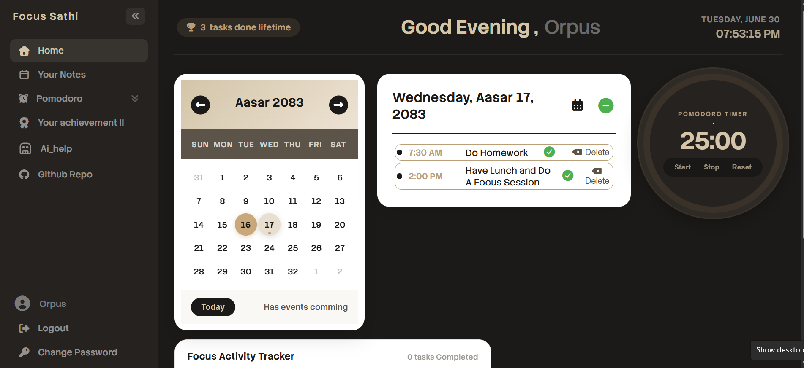
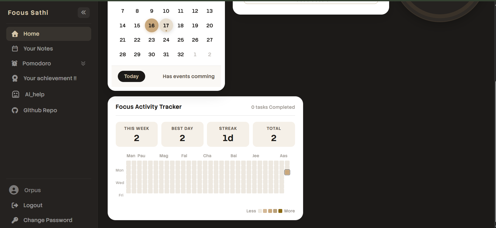
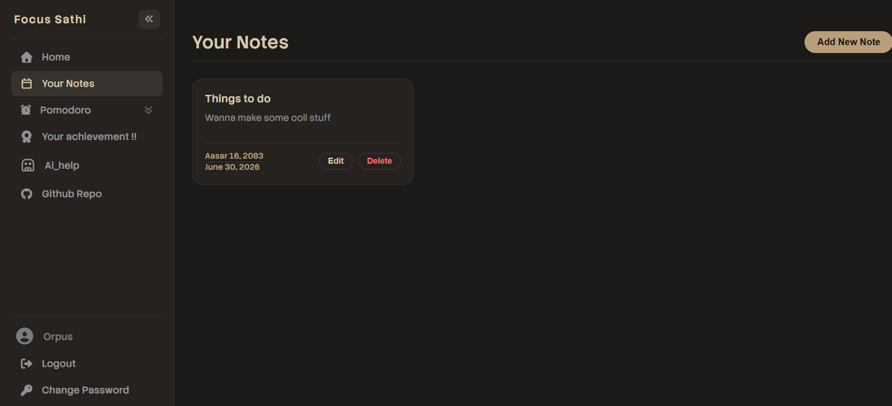
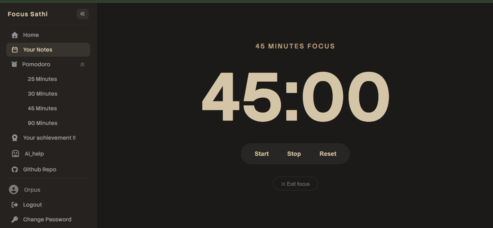
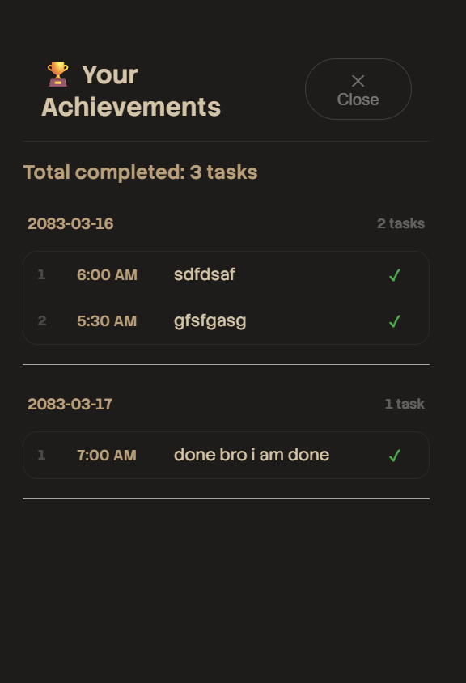
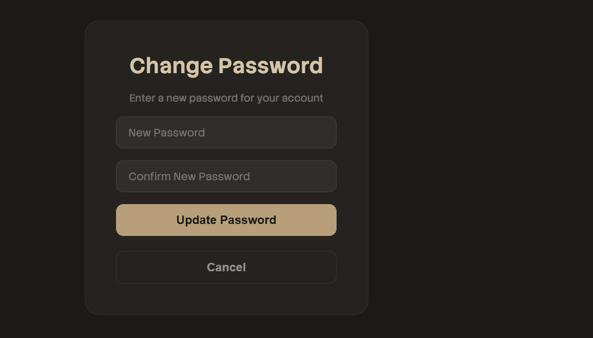
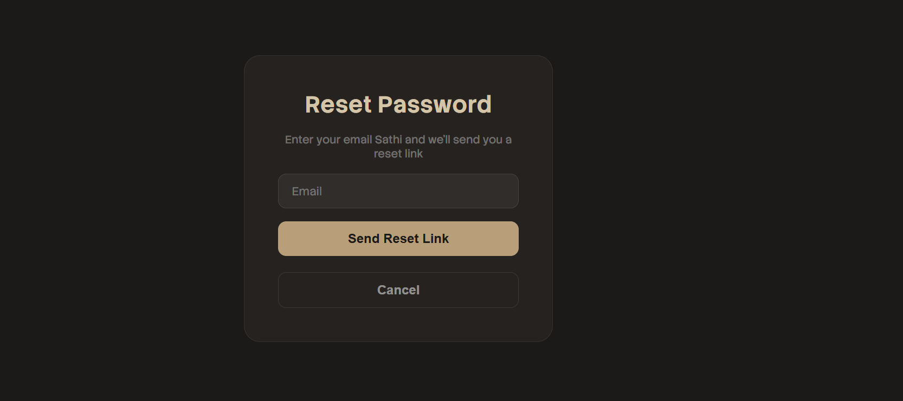

<h1>Focus Sathi</h1>

A personal productivity dashboard that is  built around a Nepali calendar  there is stuff like task management, a Pomodoro timer, and an activity tracker all in one place to help you plan your day and stay focused, the way a true "sathi" (companion in nepali ) would.

<h3>Features of sathi focus web app : </h3>
<ol>
    You get the full productivity app where there is pomodoro timer , notes app to note down your curiouuuss thought , sathi ai that is a very friendly ai companion . you get streak feature and also a achievement tab where your tasks are permamently stored in the database ..
</ol>

<h3> User Guide :</h3>

Just sign up and verify your email then: 

<ol>
    
 Explore it you can add up new tasks talk to ai and use the github style contribution chart toooo...

</ol>

<h3>Inspiration</h3>

I wanted a simple personal dashboard that  could have calender task manager and notes and ai at same place . I know there are a lot of these productivity app but i have seen no app that is built in nepali calender system so i decided to give it a try and make it . It literally took a lot of time cause i was new to java and database.. i learned a lot from this project a lotttt... and also it took a lot of time .. 

<h3>Languages Used :</h3>
<ol>
    <li>Html</li>
    <li>Css</li>
    <li>Javascript</li>
</ol>

<h3>Services Used :</h3>
<ol>
    <li>Supabase : for authentication (email + OTP) and database storage of tasks and achievements</li>
    <li>Resend : for sending OTP verification and password reset emails</li>
    <li>Nepali Date Converter : for accurate Nepali calendar calculations</li>
    <li> Sathi Ai  Backend -- My own project <a href="https://niranjansthaa11-code.github.io/Ai_Chatbot/" >Linkuuuu</a></li>
</ol>

<h4>Project Photos :</h4>

Made with freakingg loveeeee ❤️ in Nepal ....
